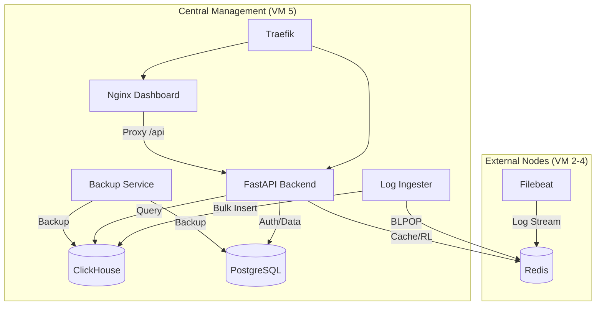

# Log_Dashboard

ระบบ Pipeline จัดการและแสดงผล Log (Log Pipeline & Dashboard) 
ระบบนี้ถูกออกแบบมาเพื่อเก็บรวบรวม, พักข้อมูล, จัดเก็บระยะยาว, และแสดงผล Log ของทุก Docker Container ภายในเซิร์ฟเวอร์แบบ Real-time

## What this repo is

Docker stack: collect Docker container logs → buffer → column DB → custom web UI

## Data path

`Filebeat` (reads Docker logs) → `Redis` (buffer) → `ingester/` Python (batch insert) → `ClickHouse`. `dashboard/` = static SPA + Nginx proxies `/clickhouse/` to CH HTTP API. `Traefik` = reverse proxy / routing.

## System Architecture

### Components Roles:
- **Traefik**: Entry point (Port 80/443), handling SSL and routing to Nginx or Backend.
- **Nginx (Dashboard)**: Serves static SPA files and proxies `/logstore/api` requests to the Backend.
- **FastAPI Backend**: 
    - Handles JWT authentication and PSU SSO (Authentik) integration.
    - Manages user roles and container ownership (PostgreSQL).
    - Proxies/Filter ClickHouse queries (Role-based access control).
    - **Caching (New)**: Uses Redis to cache heavy ClickHouse queries to improve performance.
    - **Background Tasks**: Monitors log volume (Spam) and container downtime.
- **Redis**: Multi-purpose buffer for log ingestion, FastAPI rate limiting, and result caching.
- **Log Ingester**: Python service that batches logs from Redis into ClickHouse to minimize "part" creation.
- **ClickHouse**: High-performance column-oriented database for storing and querying logs.
- **PostgreSQL**: Relational storage for users, container-user mapping, and system settings.
- **Backup**: Dedicated service running cron jobs and a bridge API for manual backup triggers.