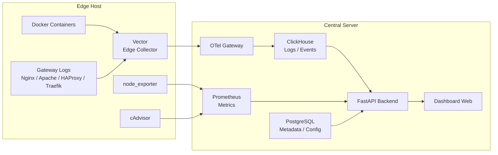
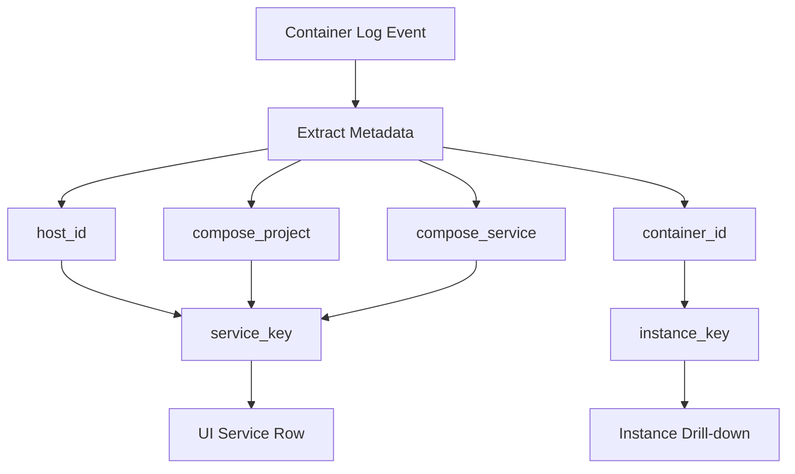

# Central / Edge Data Flow

## High-Level Flow

```mermaid
flowchart LR
  subgraph Edge["Edge Host"]
    Docker["Docker Containers"]
    Gateway["Gateway Logs<br/>Nginx / Apache / HAProxy / Traefik"]
    Vector["Vector<br/>Edge Collector"]
    NodeExporter["node_exporter"]
    CAdvisor["cAdvisor"]
  end

  subgraph Central["Central Server"]
    OTel["OTel Gateway"]
    ClickHouse["ClickHouse<br/>Logs / Events"]
    Prometheus["Prometheus<br/>Metrics"]
    Postgres["PostgreSQL<br/>Metadata / Config"]
    Backend["FastAPI Backend"]
    Dashboard["Dashboard Web"]
  end

  Docker --> Vector
  Gateway --> Vector
  Vector --> OTel
  OTel --> ClickHouse
  NodeExporter --> Prometheus
  CAdvisor --> Prometheus
  ClickHouse --> Backend
  Prometheus --> Backend
  Postgres --> Backend
  Backend --> Dashboard
```

## Service Identity Flow

```mermaid
flowchart TD
  Log["Container Log Event"] --> Metadata["Extract Metadata"]
  Metadata --> Host["host_id"]
  Metadata --> Project["compose_project"]
  Metadata --> Service["compose_service"]
  Metadata --> Container["container_id"]

  Host --> ServiceKey["service_key"]
  Project --> ServiceKey
  Service --> ServiceKey
  Container --> InstanceKey["instance_key"]

  ServiceKey --> UIService["UI Service Row"]
  InstanceKey --> UIInstance["Instance Drill-down"]
```

